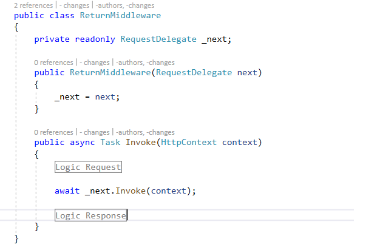

# Demo
### 1. Introduction About Middleware And Filter In .Net Core
#### a. Middleware
- Middleware is software that's assembled into an app pipeline to handle requests and responses.
- The order that middleware components are added in the Startup.Configure method defines the order in which the middleware components are invoked on requests and the reverse order for the response.
#### b. Filter
### 2. Middle Pineline

```C# 
public class ReturnMiddleware
    {
        private readonly RequestDelegate _next;

        public ReturnMiddleware(RequestDelegate next)
        {
            _next = next;
        }

        public async Task Invoke(HttpContext context)
        {
            // Logic Request           

            await _next.Invoke(context);

           // Logic Response
           
        }
    }


### 3. Filter Pineline
### 4. MiddlewareFilter
### 5. Demo
