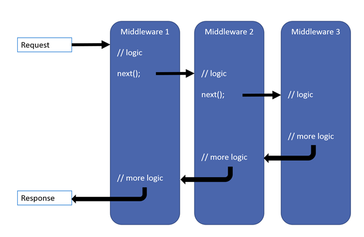
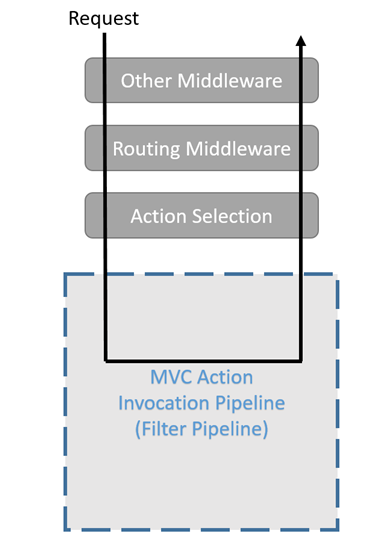
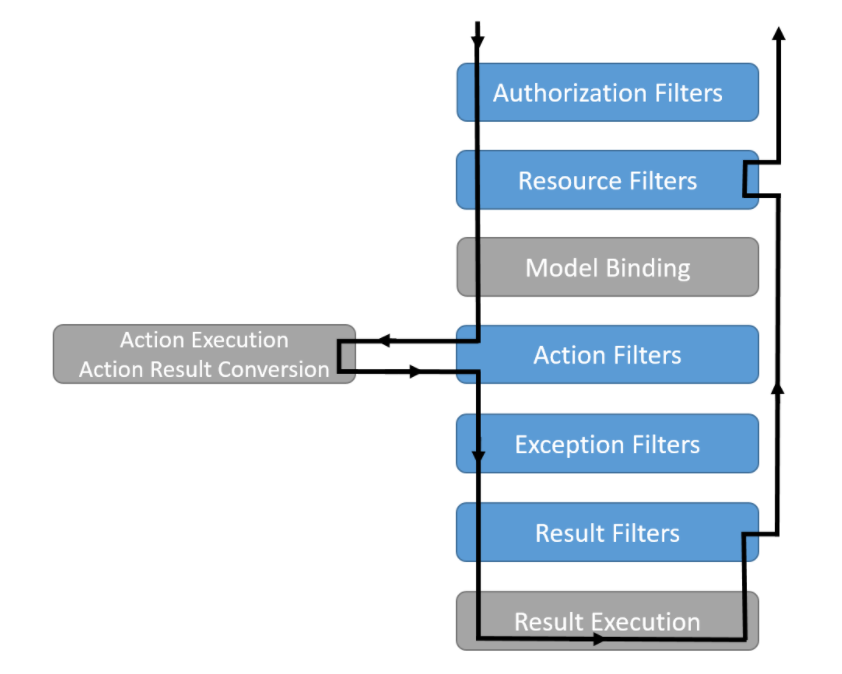

https://www.lucidchart.com/techblog/2016/11/08/angular-2-and-observables-data-sharing-in-a-multi-view-application/
https://viblo.asia/p/angular-2-observable-mot-goc-nhin-ve-chia-se-du-lieu-trong-ung-dung-angular-RQqKLO7z57z
  "ng-multiselect-dropdown": "^0.2.12",
  https://stackblitz.com/edit/ng-multiselect-dropdown?file=src%2Fapp%2Fapp.component.ts
# Demo
### 1. Introduction About Middleware In .Net Core
#### a. Middleware
- Middleware is software that's assembled into an app pipeline to handle requests and responses.
- The order that middleware components are added in the Startup.Configure method defines the order in which the middleware components are invoked on requests and the reverse order for the response.
- Request delegates are configured using **Run**, **Map**, **Use** ( **RunWhen**, **MapWhen**, **UseWhen**)  extension methods

#### b. Middle Pineline

> .Net Core Middleware Pineline



> .Net Core Middleware Code Example

```C# 
public class ReturnMiddleware
    {
        private readonly RequestDelegate _next;

        public ReturnMiddleware(RequestDelegate next)
        {
            _next = next;
        }

        public async Task Invoke(HttpContext context)
        {
            // Logic Request           

            await _next.Invoke(context);

           // Logic Response
           
        }
    }
```


### 2. A little about filters
*Disclaimer: I am not going to explain all about filters, so if you are interested in this topic, I suggest you check the Microsoft documentation*
- Filters in .NET Core allow code to be run before or after specific stages in the request processing pipeline.
- Filters run within the .NET Core action invocation pipeline, sometimes referred to as the filter pipeline. The filter pipeline runs after .NET Core selects the action to execute.
- Built-in filters handle tasks such as:  **Authorization**, **Response caching**,...
- Filters run at **multiple points** in MvcMiddleware in the normal handling of a request
> How filter work



> The following diagram shows how filter types interact in the filter pipeline



### 3. Using Middleware as filter with MiddlewareFilterAttribute Class


Filters are very powerful but that power has the complexity. There are several filters types, with different methods to be implemented, all of these methods are called in different moments of the requests.

But not always all this complexity is needed, so there is another way to get the advantages of a filter avoiding such complexity.

There is another tool that allows us to use a Middleware as a filter, this is the MiddlewareFilterAttribute. The middleware will be invoked in the filter pipeline, in the runtime execution, giving us some of the advantages of the filters with the simplicity of middlewares


### 4. Demo
